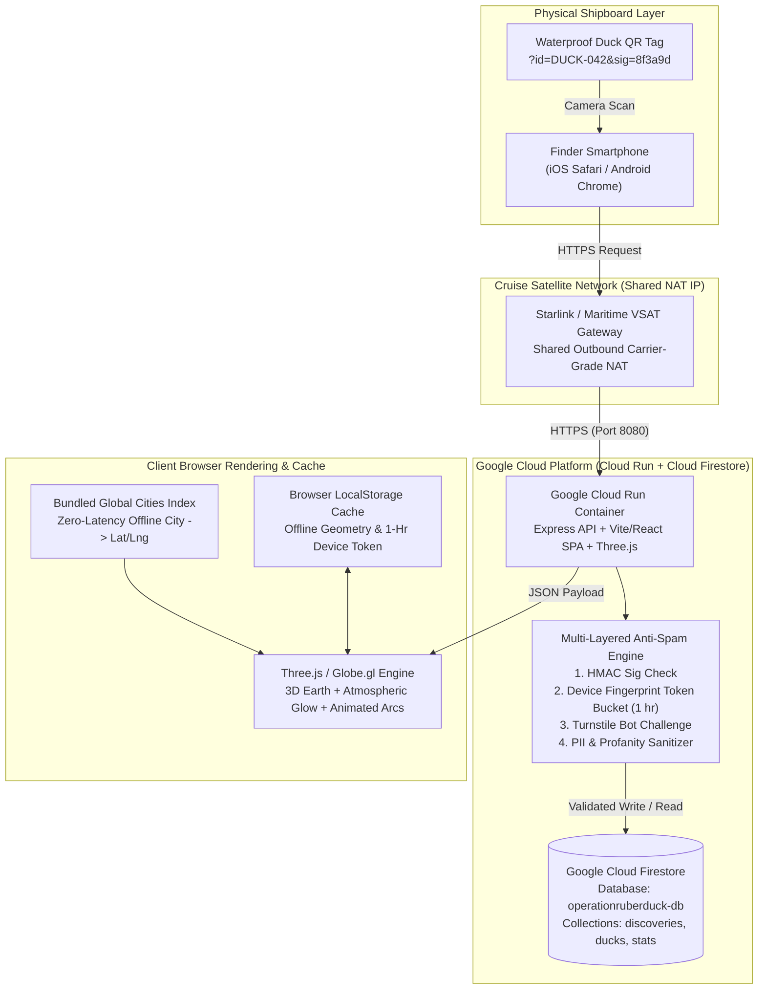

# 🦆 CruiseDuck Tracker ("Operation Rubber Duck")
## Formal Product Architecture & Engineering Specification

**Target Infrastructure:** Google Cloud Run (Serverless Container) + Google Cloud Firestore (`operationruberduck-db`)  
**Repository:** [`https://github.com/jlivanramirez7/Operation-Ruber-Duck`](https://github.com/jlivanramirez7/Operation-Ruber-Duck)  
**Target Experience:** Mobile-First Caribbean Vacation Scavenger Hunt & Interactive 3D Global Duck Telemetry

---

## 1. Executive Summary & User Stories

### 1.1 Executive Summary
**CruiseDuck Tracker ("Operation Rubber Duck")** is a physical-to-digital IoT/Web scavenger hunt built for a father-and-son cruise adventure. Custom rubber ducks equipped with marine-grade waterproof QR tags are hidden throughout the cruise ship's public decks, lounges, and promenades.

When a fellow passenger discovers a duck and scans its QR code (`?id=DUCK-042&sig=8f3a9d`), they are immediately welcomed by a vibrant, Caribbean-vacation-themed mobile web application running on **Google Cloud Run**. Without creating an account or surrendering any Personally Identifiable Information (PII), the finder logs their hometown (`City`, `State/Country`) and an optional congratulatory note (max 100 characters). Their discovery immediately illuminates a glowing pin on an interactive 3D spinning globe (`Three.js / Globe.gl`), drawing an animated flight arc from their hometown to the Caribbean Sea and updating the real-time shipboard leaderboard.

---

## 2. System Architecture & Data Flow

### 2.1 High-Level Component Architecture

---

## 3. Cloud Firestore Schema Design (`operationruberduck-db`)

All persistent game state is stored in **Google Cloud Firestore** within the named database **`operationruberduck-db`**.

- **Collection `ducks` (`ducks/{duckId}`)**: Master catalog of hidden cruise ducks (`DUCK-001` through `DUCK-050`), their hiding deck hints, cryptographic signature hashes, and total find counts.
- **Collection `discoveries` (`discoveries/{discoveryId}`)**: Verified duck sightings with zero PII (`city`, `region`, `country`, `lat`, `lng`, `distanceMilesToShip`, `note`, `deckFound`, `createdAt`).
- **Collection `rate_limits` (`rate_limits/{fingerprintHash}`)**: Cruise-ship NAT-safe device cooldown records (prevents multiple submissions from the same device within 1 hour without blocking the cruise ship's shared Carrier-Grade NAT IP).

---

## 4. Cruise-Ship NAT-Aware Anti-Spam & Geolocation Strategy

1. **Zero-PII Enforcement:** Strictly no login, names, emails, or phone numbers collected. Regex scrubbers strip any accidental emails or phone numbers from congratulatory notes before database insertion.
2. **Cruise-Ship NAT-Safe Device Rate Limiting:** Combines browser canvas/screen/timezone fingerprinting with a persistent local device token (`cruiseduck_device_token`) to enforce a 1-hour per-duck cooldown per physical device while allowing thousands of fellow passengers on the same Starlink Maritime NAT IP to submit simultaneously.
3. **Cryptographic QR Signature Validation (`?id=DUCK-042&sig=8f3a9d`):** HMAC-SHA256 verification ensures authentic scans from physical waterproof duck tags.
4. **Low-Bandwidth & Offline Resilience:** Includes a bundled world cities dataset (`worldCities.ts`) with Nominatim fallback and local storage caching of recent pins for smooth 3D rendering on satellite Wi-Fi.
